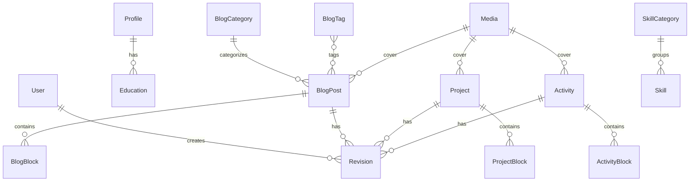

# PASIRI PORTFOLIO — DATABASE SCHEMA SPECIFICATION

This document details the relational data model for **PASIRI PORTFOLIO**, engineered using **Prisma ORM** for PostgreSQL / SQLite compatibility.

> **CRITICAL RULE REMINDER**:
> There is **NO** dedicated `TimelineItem` or `TimelineCategory` database model.
> The **Process Timeline** is strictly a structured content block (`process_timeline`) within `ProjectBlock`, `ActivityBlock`, and `BlogBlock` or JSON block streams.

---

## 1. Entity Relationship Overview



---

## 2. Prisma Schema Definition

```prisma
datasource db {
  provider = "postgresql" // supports sqlite for lightweight local testing
  url      = env("DATABASE_URL")
}

generator client {
  provider = "prisma-client-js"
}

// ----------------------------------------------------
// AUTHENTICATION & USER
// ----------------------------------------------------

enum Role {
  ADMIN
  EDITOR
}

model User {
  id           String     @id @default(cuid())
  email        String     @unique
  name         String
  passwordHash String
  role         Role       @default(ADMIN)
  createdAt    DateTime   @default(now())
  updatedAt    DateTime   @updatedAt
  revisions    Revision[]

  @@map("users")
}

// ----------------------------------------------------
// PROFILE, BIO & EDUCATION
// ----------------------------------------------------

model Profile {
  id           String      @id @default(cuid())
  fullName     String      @default("pasiri")
  headline     String      @default("Software Engineer & Digital Product Designer")
  bio          String      @db.Text
  philosophy   String?     @db.Text
  currentFocus String?     @db.Text
  interests    String?     @db.Text
  avatarUrl    String?
  resumeUrl    String?
  email        String?
  githubUrl    String?
  linkedinUrl  String?
  twitterUrl   String?
  websiteUrl   String?
  location     String?     @default("Bangkok, Thailand")
  availableFor String?     @default("Available for selected consulting & design engineering")
  createdAt    DateTime    @default(now())
  updatedAt    DateTime    @updatedAt
  educations   Education[]

  @@map("profiles")
}

model Education {
  id           String    @id @default(cuid())
  profileId    String
  institution  String
  degree       String
  field        String
  startDate    DateTime
  endDate      DateTime?
  current      Boolean   @default(false)
  description  String?   @db.Text
  location     String?
  order        Int       @default(0)
  createdAt    DateTime  @default(now())
  updatedAt    DateTime  @updatedAt
  profile      Profile   @relation(fields: [profileId], references: [id], onDelete: Cascade)

  @@map("educations")
}

// ----------------------------------------------------
// EXPERIENCE (Itemized List / Vertical Timeline)
// ----------------------------------------------------

model Experience {
  id           String    @id @default(cuid())
  title        String
  organization String
  location     String?
  startDate    DateTime
  endDate      DateTime?
  present      Boolean   @default(false)
  description  String    @db.Text
  tags         String?   // Comma-separated or JSON array string
  linkUrl      String?
  order        Int       @default(0)
  isVisible    Boolean   @default(true)
  createdAt    DateTime  @default(now())
  updatedAt    DateTime  @updatedAt

  @@map("experiences")
}

// ----------------------------------------------------
// SKILLS & CATEGORIES
// ----------------------------------------------------

model SkillCategory {
  id        String   @id @default(cuid())
  name      String   @unique // e.g. "Programming", "Frontend", "Backend", "Database", "Tools", "Design"
  order     Int      @default(0)
  createdAt DateTime @default(now())
  updatedAt DateTime @updatedAt
  skills    Skill[]

  @@map("skill_categories")
}

model Skill {
  id          String        @id @default(cuid())
  categoryId  String
  name        String
  description String?
  order       Int           @default(0)
  isFeatured  Boolean       @default(false)
  createdAt   DateTime      @default(now())
  updatedAt   DateTime      @updatedAt
  category    SkillCategory @relation(fields: [categoryId], references: [id], onDelete: Cascade)

  @@map("skills")
}

// ----------------------------------------------------
// CERTIFICATIONS
// ----------------------------------------------------

model Certification {
  id             String    @id @default(cuid())
  name           String
  issuer         String
  issueDate      DateTime
  expirationDate DateTime?
  credentialId   String?
  credentialUrl  String?
  imageUrl       String?
  order          Int       @default(0)
  isVisible      Boolean   @default(true)
  createdAt      DateTime  @default(now())
  updatedAt      DateTime  @updatedAt

  @@map("certifications")
}

// ----------------------------------------------------
// CONTENT STATUS ENUM
// ----------------------------------------------------

enum ContentStatus {
  DRAFT
  PUBLISHED
  ARCHIVED
}

// ----------------------------------------------------
// PROJECTS & CASE STUDIES
// ----------------------------------------------------

model Project {
  id              String         @id @default(cuid())
  title           String
  slug            String         @unique
  shortSummary    String         @db.Text
  role            String?
  clientOrContext String?
  category        String         @default("Engineering") // "Engineering", "Design", "Research"
  tags            String?        // Comma-separated
  technologies    String?        // Comma-separated
  coverImage      String?
  galleryImages   String?        // JSON Array string
  externalUrl     String?
  githubUrl       String?
  featured        Boolean        @default(false)
  status          ContentStatus  @default(DRAFT)
  sortOrder       Int            @default(0)
  completedAt     DateTime?
  seoTitle        String?
  seoDescription  String?        @db.Text
  ogImage         String?
  rawContent      String?        @db.Text // Tiptap JSON or Markdown fallback
  createdAt       DateTime       @default(now())
  updatedAt       DateTime       @updatedAt
  blocks          ProjectBlock[]
  revisions       Revision[]

  @@index([slug])
  @@index([status, featured])
  @@map("projects")
}

model ProjectBlock {
  id        String   @id @default(cuid())
  projectId String
  type      String   // "paragraph", "heading", "image", "video", "gallery", "code", "quote", "callout", "process_timeline"
  order     Int      @default(0)
  data      String   @db.Text // JSON representation of structured block data
  createdAt DateTime @default(now())
  updatedAt DateTime @updatedAt
  project   Project  @relation(fields: [projectId], references: [id], onDelete: Cascade)

  @@index([projectId, order])
  @@map("project_blocks")
}

// ----------------------------------------------------
// ACTIVITIES (Events, Bootcamps, Workshops, Competitions)
// ----------------------------------------------------

model Activity {
  id              String          @id @default(cuid())
  title           String
  slug            String          @unique
  shortSummary    String          @db.Text
  category        String          // e.g. "Competition", "Bootcamp", "Workshop", "Teaching", "Exhibition"
  location        String?
  eventDate       DateTime
  coverImage      String?
  galleryImages   String?         // JSON Array string
  tags            String?
  externalLinks   String?         // JSON string of links
  featured        Boolean         @default(false)
  status          ContentStatus   @default(DRAFT)
  sortOrder       Int             @default(0)
  seoTitle        String?
  seoDescription  String?         @db.Text
  ogImage         String?
  rawContent      String?         @db.Text
  createdAt       DateTime        @default(now())
  updatedAt       DateTime        @updatedAt
  blocks          ActivityBlock[]
  revisions       Revision[]

  @@index([slug])
  @@index([status, sortOrder])
  @@map("activities")
}

model ActivityBlock {
  id         String   @id @default(cuid())
  activityId String
  type       String   // e.g. "paragraph", "image", "video", "process_timeline", "quote"
  order      Int      @default(0)
  data       String   @db.Text // JSON representation
  createdAt  DateTime @default(now())
  updatedAt  DateTime @updatedAt
  activity   Activity @relation(fields: [activityId], references: [id], onDelete: Cascade)

  @@index([activityId, order])
  @@map("activity_blocks")
}

// ----------------------------------------------------
// BLOG (Articles, Essays, Case Notes)
// ----------------------------------------------------

model BlogCategory {
  id          String     @id @default(cuid())
  name        String     @unique
  slug        String     @unique
  description String?
  posts       BlogPost[]

  @@map("blog_categories")
}

model BlogTag {
  id    String     @id @default(cuid())
  name  String     @unique
  slug  String     @unique
  posts BlogPost[]

  @@map("blog_tags")
}

model BlogPost {
  id             String        @id @default(cuid())
  title          String
  slug           String        @unique
  excerpt        String        @db.Text
  coverImage     String?
  author         String        @default("pasiri")
  categoryId     String?
  readingTimeMin Int           @default(3)
  status         ContentStatus @default(DRAFT)
  featured       Boolean       @default(false)
  publishedAt    DateTime?
  seoTitle       String?
  seoDescription String?       @db.Text
  ogImage        String?
  rawContent     String?       @db.Text // Complete Tiptap JSON or Markdown content
  createdAt      DateTime      @default(now())
  updatedAt      DateTime      @updatedAt
  category       BlogCategory? @relation(fields: [categoryId], references: [id], onDelete: SetNull)
  tags           BlogTag[]
  blocks         BlogBlock[]
  revisions      Revision[]

  @@index([slug])
  @@index([status, publishedAt])
  @@map("blog_posts")
}

model BlogBlock {
  id        String   @id @default(cuid())
  postId    String
  type      String   // "paragraph", "heading", "image", "video", "code", "callout", "process_timeline", etc.
  order     Int      @default(0)
  data      String   @db.Text // JSON representation
  createdAt DateTime @default(now())
  updatedAt DateTime @updatedAt
  post      BlogPost @relation(fields: [postId], references: [id], onDelete: Cascade)

  @@index([postId, order])
  @@map("blog_blocks")
}

// ----------------------------------------------------
// MEDIA ASSETS LIBRARY
// ----------------------------------------------------

model Media {
  id          String   @id @default(cuid())
  filename    String   // Safe storage name (e.g. "media-17384912-3f8a.webp")
  originalName String  // Human uploaded name (e.g. "architecture-diagram.webp")
  url         String   // Public or CDN URL
  mimeType    String   // "image/webp", "image/png", "application/pdf"
  fileSize    Int      // In bytes
  width       Int?
  height      Int?
  altText     String?
  caption     String?
  folder      String   @default("general") // "projects", "activities", "blog", "general"
  createdAt   DateTime @default(now())
  updatedAt   DateTime @updatedAt

  @@index([folder])
  @@map("media")
}

// ----------------------------------------------------
// REVISION SNAPSHOTS
// ----------------------------------------------------

model Revision {
  id          String    @id @default(cuid())
  entityType  String    // "BlogPost", "Project", "Activity"
  entityId    String
  version     Int       @default(1)
  title       String
  snapshot    String    @db.Text // Full JSON snapshot of content and metadata
  authorId    String?
  createdAt   DateTime  @default(now())
  user        User?     @relation(fields: [authorId], references: [id], onDelete: SetNull)
  project     Project?  @relation(fields: [entityId], references: [id], onDelete: Cascade, map: "rev_project_fk")
  activity    Activity? @relation(fields: [entityId], references: [id], onDelete: Cascade, map: "rev_activity_fk")
  blogPost    BlogPost? @relation(fields: [entityId], references: [id], onDelete: Cascade, map: "rev_blog_fk")

  @@index([entityType, entityId])
  @@map("revisions")
}

// ----------------------------------------------------
// WEBSITE CMS, NAVIGATION & SECTIONS
// ----------------------------------------------------

model NavigationItem {
  id        String   @id @default(cuid())
  label     String
  href      String
  isExternal Boolean  @default(false)
  order     Int      @default(0)
  isEnabled Boolean  @default(true)
  createdAt DateTime @default(now())
  updatedAt DateTime @updatedAt

  @@map("navigation_items")
}

model HomepageSection {
  id          String   @id @default(cuid())
  sectionKey  String   @unique // "hero", "featured_projects", "selected_activities", "latest_blog", "experience", "skills", "certifications", "contact_cta"
  title       String
  subtitle    String?  @db.Text
  order       Int      @default(0)
  isEnabled   Boolean  @default(true)
  customData  String?  @db.Text // Configurable JSON for arbitrary section options
  updatedAt   DateTime @updatedAt

  @@map("homepage_sections")
}

// ----------------------------------------------------
// SYSTEM, THEME & SEO SETTINGS
// ----------------------------------------------------

model SiteSetting {
  id          String   @id @default(cuid())
  key         String   @unique
  value       String   @db.Text
  description String?
  updatedAt   DateTime @updatedAt

  @@map("site_settings")
}

model ThemeSetting {
  id             String   @id @default("default")
  accentColor    String   @default("#2d7063")
  accentHover    String   @default("#388a7b")
  fontFamily     String   @default("Inter")
  monoFont       String   @default("Geist Mono")
  borderRadius   String   @default("0.5rem")
  smokeveilDark  Boolean  @default(true)
  smokeveilLight Boolean  @default(true)
  updatedAt      DateTime @updatedAt

  @@map("theme_settings")
}

model SEOSetting {
  id             String   @id @default("default")
  siteTitle      String   @default("pasiri — Portfolio & Case Studies")
  siteDescription String  @default("Personal digital home, engineering portfolio, activities, and design case studies of pasiri.")
  authorName     String   @default("pasiri")
  keywords       String   @default("pasiri, portfolio, software engineer, UX UI design, frontend, case studies")
  defaultOgImage String?
  twitterHandle  String?  @default("@pasiri")
  robotsTxt      String   @default("User-agent: *\nAllow: /\nDisallow: /admin/\nDisallow: /api/")
  sitemapEnabled Boolean  @default(true)
  updatedAt      DateTime @updatedAt

  @@map("seo_settings")
}
```

---

## 3. Structured Block JSON Definitions (e.g. Process Timeline)

Blocks saved within `data` or `rawContent` follow strict JSON schema definitions:

### Process Timeline Block Data (`process_timeline`):
```json
{
  "title": "กระบวนการทำงาน / Design & Engineering Process",
  "subtitle": "Iterative design-thinking workflow applied throughout this project",
  "steps": [
    {
      "stepNumber": "01",
      "title": "Empathize & Stakeholder Discovery",
      "description": "Conducted in-depth interviews with 12 end-users to uncover friction points in real-time data inspection.",
      "mediaUrl": "/uploads/media/process-step-1.webp",
      "mediaType": "image",
      "quote": "Users spent over 40% of their session trying to locate historical logs.",
      "linkUrl": null
    },
    {
      "stepNumber": "02",
      "title": "Define & Problem Framing",
      "description": "Synthesized findings into an actionable design brief focusing on sub-second indexing and zero-noise layout.",
      "mediaUrl": null,
      "mediaType": null,
      "quote": null,
      "linkUrl": null
    },
    {
      "stepNumber": "03",
      "title": "Ideate & Prototyping",
      "description": "Created 3 low-fidelity interactive prototypes in Figma exploring split-screen editorial side nav and collapsible drawer indices.",
      "mediaUrl": "/uploads/media/figma-proto.webp",
      "mediaType": "image"
    },
    {
      "stepNumber": "04",
      "title": "Implementation & Performance Tuning",
      "description": "Engineered the solution with Next.js App Router, custom WebGL/SVG blend layers, and sub-100ms response cache.",
      "mediaUrl": null
    }
  ]
}
```
